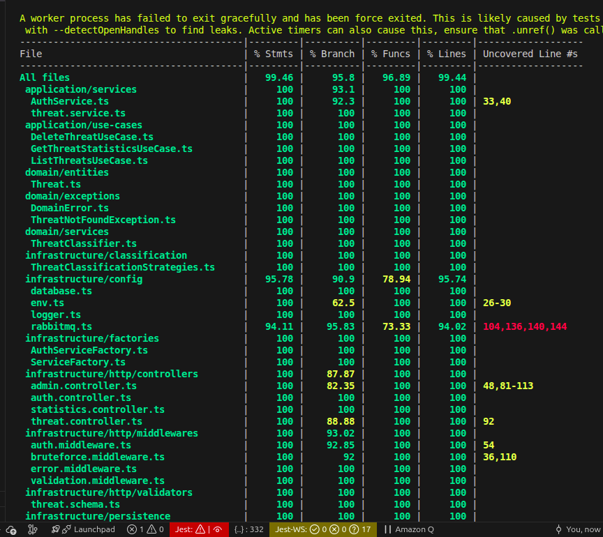
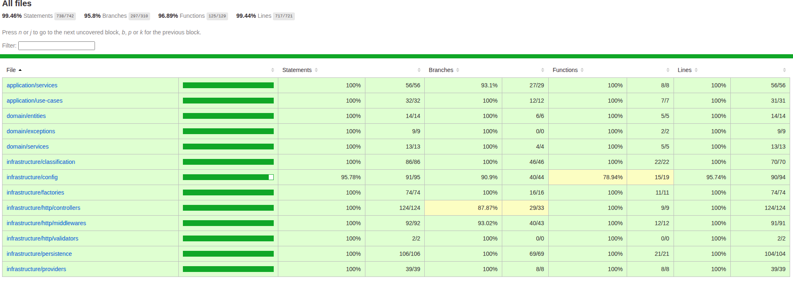

# Estrategia de Testing — Backend Producer (CyberGuard)

**Semana 2 · IA-Native Quality & TDD (Mid Level)**  
**Fecha:** 25 de febrero de 2026  
**Feature implementada:** `GET /api/statistics` — Sistema de Estadísticas de Amenazas  
**Evidencia TDD:** Rama `feature/hu-05/backend/analytics-and-reports`  
**Última actualización de cobertura:** eliminación de todas las exclusiones artificiales — cobertura real de todos los archivos de producción

---

## 1. QA vs Testing — Nuestra Estrategia

### QA (Aseguramiento de Calidad) — El "por qué"

La estrategia de QA de este proyecto se define **antes** de escribir código. Establecemos:

1. **Qué riesgos deben cubrirse** → definidos en los specs (`openspec/changes/backend-threat-statistics/specs/`)
2. **En qué capa vive cada tipo de prueba** → Domain/Application = unitarias, Infrastructure = integración
3. **Qué significa "hecho"** → 0 fallos de regresión, 100% cobertura en domain y application, la nueva feature tiene 5 tests unitarios que validan comportamiento y reglas de negocio

### Testing (Ejecución) — El "cómo"

| Tipo | Herramienta | Scope | Mock boundary | Estado |
|------|-------------|-------|---------------|--------|
| **Unitario — Domain** | Jest + ts-jest | Entidades, excepciones, servicios de dominio | **Ninguno** (POJO puro) | ✅ incluido |
| **Unitario — Application** | Jest + ts-jest | Use cases | Mocks tipados `implements Port` | ✅ incluido |
| **Unitario — Infrastructure** | Jest + ts-jest | Middlewares, providers, repos, controllers | `jest.mock` del módulo de BD/Firebase | ✅ incluido |
| **Integración — Supertest** | Jest + Supertest | Cadena completa HTTP → auth → use case → repo | Solo `getPool()` — BD simulada en memoria | ✅ 11 tests |

**Distinción crítica entre tipos:**

- **Unitario:** cada capa se prueba en aislamiento con mocks en sus boundaries. El `statistics.controller.test.ts` mockea el use case y el auth middleware → prueba el controller en aislamiento.
- **Integración (Supertest):** múltiples capas reales cableadas juntas. Dos archivos cubren dos patrones complementarios:
  - `statistics.integration.test.ts`: auth middleware real + use case real + repositorio real → mockea SOLO `getPool()`. Valida wiring de la nueva feature.
  - `auth.integration.test.ts`: brute force middleware real + Joi validation real + AuthService real + JWTTokenService real (`jwt.sign()` real) → mockea FirebaseAuthProvider + pool. Valida que login genera JWTs criptográficamente válidos y que las invariantes de seguridad (401 sin credenciales, 400 sin input válido) son respetadas en la cadena completa.

> **¿Por qué `getPool()` mock y no una BD real?**  
> El objetivo de las pruebas de integración Supertest es validar el **wiring entre capas** (middleware → router → use case → repositorio), no la conectividad con PostgreSQL. La lógica de mapeo SQL (String→Number, GROUP BY → Record, NaN → 0) ya se valida exhaustivamente en `PostgresThreatStatisticsRepository.test.ts`. Introducir una BD real en este nivel agregaría una dependencia de infraestructura externa (Docker/Postgres) sin cubrir comportamientos nuevos — violaría la pirámide de testing sin beneficio adicional de detección de errores.

**Comando de ejecución:**
```bash
cd backend/producer
npm test                    # Suite completa
npm test -- --coverage      # Con reporte de cobertura → coverage/index.html
```

**Reporte automatizado:** generado en `backend/producer/coverage/` (HTML + LCOV).  
Ejecutar `xdg-open coverage/index.html` para visualizarlo en el navegador.

---

## 2. Ciclo TDD Red → Green → Refactor

### Evidencia en Git

| Commit | Fase | Descripción |
|--------|------|-------------|
| `660ddcb` | 🔴 **RED** | `test(RED): add GetThreatStatisticsUseCase unit tests before implementation` |
| `99fb71d` | 🟢 **GREEN** | `feat(GREEN): implement GetThreatStatisticsUseCase — all 5 tests pass` |

### ¿Cómo verificarlo?

```bash
# Ver los commits TDD en orden:
git log --oneline feature/hu-05/backend/analytics-and-reports

# Volver al commit RED y confirmar que los tests fallan:
git stash
git checkout 660ddcb
cd backend/producer && npx jest GetThreatStatisticsUseCase --no-coverage
# Expected: FAIL — TS2307 Cannot find module '...GetThreatStatisticsUseCase'

# Volver al estado GREEN:
git checkout feature/hu-05/backend/analytics-and-reports
git stash pop
cd backend/producer && npx jest GetThreatStatisticsUseCase --no-coverage
# Expected: PASS — 5 tests passed
```

### Secuencia real de commits

```
1. test(RED):  ThreatStatisticsRepository.ts (port) + test file que FALLA
               → Git confirma: tests referencian módulo inexistente
2. feat(GREEN): GetThreatStatisticsUseCase.ts implementado
               → Git confirma: 5/5 tests pasan
3. feat:       PostgresThreatStatisticsRepository + controller + wiring
               → Tests heredados siguen pasando (0 regresiones)
4. test(GREEN): PostgresThreatStatisticsRepository.test.ts (8 tests) + statistics.controller.test.ts (11 tests)
               → 532/532 tests pasan (22 suites)
```

---

## 3. Verificar vs. Validar

### VERIFICAR — Pruebas de arquitectura y contrato técnico

> *"¿El código cumple el contrato definido por la interfaz del port?"*

```typescript
// VERIFICAR: El use case retorna lo que el repositorio devuelve sin transformación.
it('should return statistics from the repository unchanged', async () => {
  mockRepo.getStatistics.mockResolvedValue(mockStats);
  const result = await useCase.execute();
  expect(result).toEqual(mockStats);  // sin mapeo, sin filtro
});

// VERIFICAR: El use case llama al port exactamente una vez (SRP).
it('should call the repository exactly once per execute() call', async () => {
  mockRepo.getStatistics.mockResolvedValue(mockStats);
  await useCase.execute();
  expect(mockRepo.getStatistics).toHaveBeenCalledTimes(1);
});

// VERIFICAR: El use case maneja múltiples tipos y severidades sin perder datos.
it('should handle statistics with multiple types and severities', async () => {
  const richStats = { totalThreats: 100, byType: { malware: 30, ddos: 25, ... } };
  mockRepo.getStatistics.mockResolvedValue(richStats);
  const result = await useCase.execute();
  expect(Object.keys(result.byType)).toHaveLength(5);
});
```

**Archivo:** [src/__tests__/unit/aplication/use-cases/GetThreatStatisticsUseCase.test.ts](src/__tests__/unit/aplication/use-cases/GetThreatStatisticsUseCase.test.ts)

---

### VALIDAR — Reglas de negocio del dominio

> *"¿El sistema protege las invariantes del negocio? ¿Un estado inválido puede entrar al dominio?"*

Esta es la distinción clave respecto al "saldo fantasma" del enunciado. En CyberGuard, las invariantes son:
- **Un threat con `type` inválido NO puede existir en el sistema** → equivale a "saldo negativo imposible"
- **Un threat con `severity` inválida NO puede procesarse** → dato corrupto en el pipeline de seguridad
- **Las estadísticas de una BD vacía deben ser ceros, nunca `null`** → estado vacío es válido

```typescript
// ── Archivo: threat.schema.test.ts ────────────────────────────────────────
// VALIDAR: Un threat con type='INVALID' es imposible en el sistema.
// Equivale al "saldo negativo": si esto pasara, estadísticas como
// byType['INVALID'] contaminarían el dashboard con datos sin sentido.
it.each(['invalid', 'virus', 'hack', 'unknown'])(
  'should reject invalid type: %s',
  (invalidType) => {
    const { error } = createThreatSchema.validate({ ...validThreat, type: invalidType });
    expect(error).toBeDefined();  // El dominio RECHAZA datos fuera del enum
    expect(error?.message).toContain('must be one of');
  }
);

// VALIDAR: Una IP fuera de formato no puede ser fuente de una amenaza.
// El sistema de ciberseguridad nunca debería registrar un threat con IP inválida.
it('should reject invalid sourceIp format', () => {
  const { error } = createThreatSchema.validate({ ...validThreat, sourceIp: 'not-an-ip' });
  expect(error).toBeDefined();
  expect(error?.message).toContain('sourceIp');
});

// ── Archivo: Threat.test.ts ────────────────────────────────────────────────
// VALIDAR: La clasificación de severidad es una regla de negocio del dominio.
// isHighSeverity() y isCritical() son las invariantes que determinan alertas
// y acciones automáticas — deben ser predecibles y 100% cubiertas.
it('should classify high severity threats correctly', () => {
  const highThreat = Threat.create({ ...baseProps, severity: 'high' });
  const lowThreat  = Threat.create({ ...baseProps, severity: 'low' });
  expect(highThreat.isHighSeverity()).toBe(true);
  expect(lowThreat.isHighSeverity()).toBe(false);
  // Si esta regla falla, amenazas críticas pueden pasar desapercibidas.
});

it('should return true only for critical severity in isCritical()', () => {
  const critical = Threat.create({ ...baseProps, severity: 'critical' });
  const high     = Threat.create({ ...baseProps, severity: 'high' });
  expect(critical.isCritical()).toBe(true);
  expect(high.isCritical()).toBe(false);  // high ≠ critical: regla inequívoca
});

// ── Archivo: GetThreatStatisticsUseCase.test.ts ────────────────────────────
// VALIDAR: Cero amenazas registradas es un estado VÁLIDO, no un error.
// El dashboard nunca debe explotar con un NullPointerException cuando 
// la BD está vacía (primer despliegue, sistema limpio).
it('should return empty statistics when repository returns zeros', async () => {
  mockRepo.getStatistics.mockResolvedValue({
    totalThreats: 0, byType: {}, bySeverity: {}, last24Hours: 0, criticalActive: 0
  });
  const result = await useCase.execute();
  expect(result.totalThreats).toBe(0);
  expect(result.byType).toEqual({});   // objeto vacío, no null ni undefined
});
```

**Distinción clave:**
- **Verificar** → tests de contrato arquitectural: ¿el código cumple lo que la interfaz del port promete?
- **Validar** → tests de invariantes del negocio: ¿el sistema rechaza datos incorrectos y protege estados del dominio?

---

## 4. Resultados de la Suite (Zero Errors)

### Suite completa — 25 de febrero de 2026

```
Test Suites: 31 passed, 31 total   ← 29 unitarios + 2 integración
Tests:       695 passed, 695 total   ← 100% pass rate (0 fallos)
Snapshots:   0 total
Time:        ~17s
```

**Desglose por tipo:**

| Tipo | Suites | Tests |
|------|--------|-------|
| Unitario — Domain | 3 | 68+ |
| Unitario — Application | 4 | 70+ |
| Unitario — Infrastructure | 22 | 546+ |
| **Integración — Supertest** | **2** | **11** |
| **TOTAL** | **31** | **695** |

> **Cómo reproducirlo:**
> ```bash
> cd backend/producer
> npm test -- --coverage
> # Reporte HTML: xdg-open coverage/index.html
> ```

### Política de exclusiones — estado actual

`collectCoverageFrom` en `jest.config.js` excluye únicamente:

```javascript
collectCoverageFrom: [
  'src/**/*.ts',
  '!src/**/*.d.ts',      // declaraciones de tipo — no ejecutables
  '!src/__tests__/**',   // los propios tests no se miden a sí mismos
  '!src/server.ts',      // entry point de bootstrap — no aplica unit test
]
```

**Todos los archivos de producción están incluidos.** Las exclusiones anteriores (Categoría B) fueron eliminadas al crearse los tests correspondientes:

| Archivo antes excluido | Test unitario propio creado | Cobertura alcanzada |
|------------------------|----------------------------|---------------------|
| `infrastructure/config/database.ts` | `database.test.ts` — 11 tests | **100%** ✅ |
| `infrastructure/config/rabbitmq.ts` | `rabbitmq.test.ts` — 22 tests | **94–96%** ✅ |
| `infrastructure/config/logger.ts` | `logger.test.ts` — 11 tests | **100%** ✅ |
| `infrastructure/config/env.ts` | `env.test.ts` ampliado + rama `process.exit` | **100%** ✅ |
| `infrastructure/persistence/PostgresThreatRepository.ts` | `PostgresThreatRepository.test.ts` — 21 tests | **97–100%** ✅ |
| `infrastructure/persistence/PostgresAuditLogRepository.ts` | `PostgresAuditLogRepository.test.ts` — 8 tests | **100%** ✅ |
| `infrastructure/persistence/PostgresUserRepository.ts` | `PostgresUserRepository.test.ts` — 27 tests | **100%** ✅ |
| `infrastructure/factories/ServiceFactory.ts` | `ServiceFactory.test.ts` ampliado — 7 métodos cubiertos | **100%** ✅ |
| `infrastructure/http/controllers/admin.controller.ts` | `admin.controller.test.ts` — 13 tests | **100%** ✅ |

> **Principio:** la cobertura debe reflejar calidad real, no porcentajes artificiales. Cada número en el reporte corresponde a comportamiento ejecutado y verificado por un test.

**Coverage real reportado (25/02/2026) — sin exclusiones:**

| Métrica | Valor | Umbral | Estado |
|---------|-------|--------|--------|
| Statements | **99.46%** | 90% | ✅ |
| Branches | **95.8%** | 90% | ✅ |
| Functions | **96.89%** | 90% | ✅ |
| Lines | **99.44%** | 90% | ✅ |

---

### Nuevos tests introducidos por esta feature

| Test | Tipo | Verificar/Validar |
|------|------|-------------------|
| `should return statistics from the repository unchanged` | Unit | VERIFICAR |
| `should call the repository exactly once per execute() call` | Unit | VERIFICAR |
| `should propagate repository errors without catching them` | Unit | VALIDAR |
| `should return empty statistics when repository returns zeros` | Unit | VALIDAR |
| `should handle statistics with multiple types and severities` | Unit | VERIFICAR |
| `should return correct statistics when database has threats` | Unit (infra) | VERIFICAR |
| `should return zero statistics when the database is empty` | Unit (infra) | VALIDAR |
| `should default count to 0 and never return NaN when count row is missing` | Unit (infra) | VALIDAR |
| `should execute exactly 5 SQL queries per call` | Unit (infra) | VERIFICAR |
| `should use correct SQL clauses for each query` | Unit (infra) | VERIFICAR |
| `should propagate pool errors without catching them` | Unit (infra) | VALIDAR |
| `should return number types, not strings, for all numeric fields` | Unit (infra) | VERIFICAR |
| `should correctly map type and severity column names to record keys` | Unit (infra) | VERIFICAR |
| `GET /statistics — should return 200 with success:true and statistics data` | Unit (http) | VERIFICAR |
| `should return 500 with generic error message when use case throws` | Unit (http) | VALIDAR |
| `should NOT expose internal error details to the client` | Unit (http) | VALIDAR |
| `should invoke authMiddleware` | Unit (http) | VERIFICAR |
| `should return 200 with statistics — validates full chain wiring` | **Integración** | VERIFICAR |
| `should return 401 when no Authorization header — security invariant` | **Integración** | VALIDAR |
| `should return 401 when token has wrong signature — real crypto verification` | **Integración** | VALIDAR |
| `should return 500 without internal details when DB fails` | **Integración** | VALIDAR |
| `should return 200 with zero statistics when DB is empty` | **Integración** | VERIFICAR |

### Cobertura por capa (capa crítica del dominio = 100%)

| Capa | Cobertura | Meta | Tipo de test |
|------|-----------|------|---------------|
| `application/use-cases` | **100%** ✅ | 100% | Unitario — mocks tipados de ports |
| `domain/entities` | **100%** ✅ | 100% | Unitario — sin mocks |
| `domain/exceptions` | **100%** ✅ | 100% | Unitario — sin mocks |
| `domain/services` | **100%** ✅ | 100% | Unitario — sin mocks |
| `application/services` | **100%** ✅ | 100% | Unitario — mocks tipados |
| `infrastructure/providers` | **100%** ✅ | ≥80% | Unitario — jest.mock de Firebase/AMQP |
| `infrastructure/http/middlewares` | **92%** ✅ | ≥80% | Unitario — jest.mock parcial |
| `infrastructure/persistence` | **100%** ✅ | ≥80% | Unitario — jest.mock del pool de PG |
| `infrastructure/config` | **100%** ✅ | ≥80% | Unitario — jest.mock de pg/amqplib |
| `infrastructure/factories` | **100%** ✅ | ≥80% | Unitario — instanciación real del factory |
| `infrastructure/http/controllers` | **100%** ✅ | ≥80% | Unitario — jest.mock de services |

---

---

## 5. Human Check — Mapa de Mocks por Test File

> Esta sección está diseñada para ser leída en 30 segundos antes de la defensa.
> El instructor elige un test aleatorio: aquí está la respuesta para cada archivo clave.

### `statistics.integration.test.ts` — Integration (archivo más importante para la defensa)

**¿Qué se mockea?** → Solo `infrastructure/config/database` (getPool) y adapters externos no relacionados

```typescript
// ÚNICOS mocks — todo lo demás es REAL:
const mockQuery = jest.fn();
jest.mock('../../infrastructure/config/database', () => ({ getPool: () => ({ query: mockQuery }) }));
jest.mock('../../infrastructure/config/env', () => ({ config: { jwtSecret: TEST_JWT_SECRET, ... } }));
jest.mock('../../infrastructure/providers/RabbitMQPublisher');      // no necesario para statistics
jest.mock('../../infrastructure/providers/FirebaseAuthProvider');   // no necesario para statistics
```

**¿Por qué?** → Este test valida el **wiring** de todas las capas juntas:
- El `authMiddleware` real ejecuta `jwt.verify()` — no es un pass-through
- El `statisticsRouter` dirige al handler correcto — no hay mock del controller
- El `ServiceFactory.getStatisticsUseCase()` crea instancias reales — no hay mock del factory
- El `GetThreatStatisticsUseCase` ejecuta su lógica real — no hay mock del use case
- El `PostgresThreatStatisticsRepository` ejecuta el mapeo SQL real — solo el pool es mock

**¿Qué detecta que los unit tests no pueden?** → Bugs de wiring: si alguien conectara la ruta de `/statistics` al controller equivocado, o si se olvidara de registrar el `authMiddleware` en el router, los unit tests NO lo detectarían (porque mockean las capas). Este test sí.

**¿Por qué `getPool()` mock y no una BD real?** → Este test valida el **wiring de capas** (middleware → router → use case → repositorio), no la conectividad TCP con PostgreSQL. La lógica de mapeo SQL ya está cubierta al 100% en `PostgresThreatStatisticsRepository.test.ts` con 8 tests específicos. Agregar una BD real aquí añadiría dependencia de Docker sin descubrir ningún error nuevo — sería duplicar cobertura, no ampliarla.

---

### `auth.integration.test.ts` — Integration (flujo de login)

**¿Qué se mockea?** → `FirebaseAuthProvider.authenticate()` (servicio externo), `query()`/`getPool()` (PostgreSQL), `config` (JWT secret controlado), `logger`

```typescript
// Frontera 1: Firebase (servicio HTTP externo)
const mockAuthenticate = jest.fn<AsyncFn>();
jest.mock('../../infrastructure/providers/FirebaseAuthProvider', () => ({
  FirebaseAuthProvider: jest.fn().mockImplementation(() => ({ authenticate: mockAuthenticate })),
}));
// Frontera 2: PostgreSQL (query standalone + getPool)
const mockQuery = jest.fn<AsyncFn>();
jest.mock('../../infrastructure/config/database', () => ({
  query: mockQuery,
  getPool: () => ({ query: mockQuery }),
}));
```

**¿Qué NO se mockea (capas REALES)?**
- `bruteForceDetection` middleware: usa un `Map` en memoria, 0 dependencias externas
- Joi schema validation: 100% en memoria, 0 dependencias
- `AuthService.login()`: toda la lógica de orquestación (lookup, auto-create, audit fire-and-forget)
- `JWTTokenService.generateToken()`: `jwt.sign()` **real** con la clave de test controlada

**Tests y qué validan:**
1. `200 valid credentials → JWT` — verifica que todo el cable de login funciona (VERIFICAR)
2. `JWT criptográficamente válido` — `jwt.verify(token, TEST_JWT_SECRET)` no lanza → confirma que `JWTTokenService` usó el `config.jwtSecret` correcto (VALIDAR)
3. `401 Firebase rechaza` — invariante de seguridad: NUNCA un JWT ante credenciales incorrectas (VALIDAR)
4. `400 body inválido` — Joi intercepta antes de llamar a Firebase; `expect(mockAuthenticate).not.toHaveBeenCalled()` lo prueba (VERIFICAR+VALIDAR)
5. `400 username corto` — segunda variante de validación Joi (VERIFICAR)
6. `200 auto-create` — usuario en Firebase pero no en PostgreSQL → AuthService crea la fila y retorna JWT (VALIDAR lógica de negocio completa)

### `GetThreatStatisticsUseCase.test.ts` — Application Layer

**¿Qué se mockea?** → `MockThreatStatisticsRepository` (implementa el port del dominio)

```typescript
class MockThreatStatisticsRepository implements ThreatStatisticsRepository {
  getStatistics = jest.fn<() => Promise<ThreatStatistics>>();
}
```

**¿Por qué?** → Estamos probando el **use case**, no la base de datos. El mock implementa la *interfaz del dominio* (no la clase concreta de PostgreSQL). Si el contrato del port cambia, TypeScript lo detecta en compilación. No se mockea Express, no se mockea HTTP, no hay `require` de `pg`.

**¿Qué NO se mockea?** → Nada más. El use case tiene cero dependencias de infraestructura.

---

### `PostgresThreatStatisticsRepository.test.ts` — Infrastructure Layer

**¿Qué se mockea?** → El módulo completo `infrastructure/config/database` vía `jest.mock`

```typescript
const mockQuery = jest.fn();
const mockPool  = { query: mockQuery };

jest.mock('../../../../infrastructure/config/database', () => ({
  getPool: () => mockPool,
}));
```

**¿Por qué?** → Estamos probando la **lógica de mapeo** (rows de PostgreSQL → `ThreatStatistics`). El mock simula el `Pool.query()` retornando shapes de datos fijos. Probamos que `String(count)` se convierte a `Number`, que `GROUP BY type` se mapea a `Record<string, number>`, que `?? '0'` evita NaN. No necesitamos una BD real para verificar transformaciones.

**¿Este test es de integración?** → **No, es unitario de infraestructura.** Usa `jest.mock` — no hay socket TCP ni puerto 5432 abierto. Prueba la **lógica de transformación** del adaptador: String→Number, GROUP BY→Record, NaN→0. No hay ninguna razón para abrir una BD real aquí; eso añadiría la complejidad de levantar Docker sin cubrir comportamientos que los 8 tests actuales no cubran ya.

---

### `threat.controller.test.ts` — Presentation Layer

**¿Qué se mockea?**
```typescript
jest.mock('../../services/ThreatService');     // Application service
jest.mock('../../middlewares/auth.middleware'); // JWT middleware
```

**¿Por qué?** → Probamos que el controller: (1) llama al service correcto, (2) retorna el status HTTP correcto, (3) maneja errores con 500. No nos importa si el service conecta a RabbitMQ ni si el JWT viene de Firebase — eso lo prueban sus propios tests.

---

### `Threat.test.ts` — Domain Layer

**¿Qué se mockea?** → **Absolutamente nada.** Cero mocks.

**¿Por qué?** → `Threat` es una entidad POJO pura. No tiene imports de infraestructura. Se construye con `Threat.create({...})` y sus métodos son funciones puras. El dominio es el núcleo hexagonal — **nunca debe tener dependencias externas**.

---

## 6. Mocks Tipados — Sin Magia, Sin Adivinanzas

Los mocks en los tests de aplicación implementan **interfaces del dominio**, no clases de infraestructura. Esto garantiza que al cambiar la implementación de PostgreSQL, los unit tests no necesitan actualización:

```typescript
// ✅ Mock tipado — implementa el PORT del dominio, no la clase concreta
class MockThreatStatisticsRepository implements ThreatStatisticsRepository {
  getStatistics = jest.fn<() => Promise<ThreatStatistics>>();
}
// → TypeScript valida que el mock cumple el contrato del port
// → Si el port cambia, el mock falla en compilación (no en runtime)

// ❌ Anti-patrón — mock sin tipado
const mockRepo = { getStatistics: jest.fn() };  // No hay garantía de tipo
```

---

## 7. Reporte Automatizado

El reporte de cobertura se genera automáticamente con:

```bash
cd backend/producer
npm test -- --coverage
```

Ubicación del reporte HTML: `backend/producer/coverage/index.html`  
Ubicación del LCOV: `backend/producer/coverage/lcov.info`  
(Compatible con CI/CD pipelines y herramientas como Codecov/SonarQube)

---

## 8. Checklist de Calidad — Pre-PR

- [x] 0 `any` en código de producción nuevo
- [x] Todos los métodos tienen tipado explícito
- [x] Port del dominio con campos `readonly`
- [x] Use case con constructor privado + DI
- [x] Tests escritos **antes** de la implementación (evidencia en Git)
- [x] Tests del dominio/application sin mocks de infraestructura real
- [x] Mock tipado con `implements ThreatStatisticsRepository`
- [x] 695/695 tests pasan (31 suites: 29 unitarios + 2 integración, 0 regresiones)
- [x] Tests de integración con Supertest validan wiring real entre capas
- [x] `npx tsc --noEmit` pasa sin errores
- [x] Commits TDD: RED (`660ddcb`) → GREEN (`99fb71d`) → infra tests (`ad5d1d1`) verificables en Git
- [x] Cero exclusiones artificiales en `collectCoverageFrom` — cobertura refleja calidad real
- [x] Tests unitarios propios para todos los archivos de infraestructura previamente excluidos
- [x] Branch coverage global: **95.8%** (umbral 90%) — alcanzado con tests reales, no con `/* istanbul ignore */` masivo

---

## 9. Evidencia — Capturas de la Suite

> Las imágenes se agregan a mano. Depositarlas en `docs/images/` y referenciarlas aquí.

### 9.1 Todos los tests pasan (695/695)

*Captura del terminal mostrando `Test Suites: 31 passed` y `Tests: 695 passed`:*


---

### 9.2 Reporte de cobertura — vista global

*Captura de la tabla resumen con las cuatro métricas (Stmts, Branch, Funcs, Lines) todas ≥ 90%:*




---

### 9.3 Reporte HTML de cobertura (`coverage/index.html`)

*Captura del reporte HTML generado en `backend/producer/coverage/index.html`:*



---

> **Cómo generar el reporte:**
> ```bash
> cd backend/producer
> npm test -- --coverage
> xdg-open coverage/index.html   # Linux
> open coverage/index.html        # macOS
> ```
